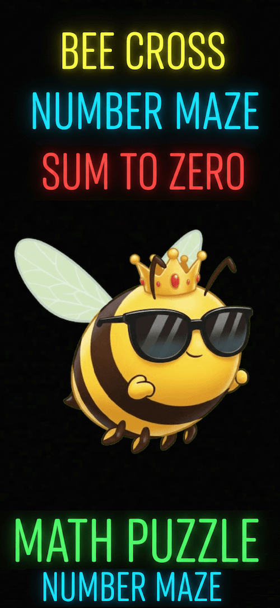
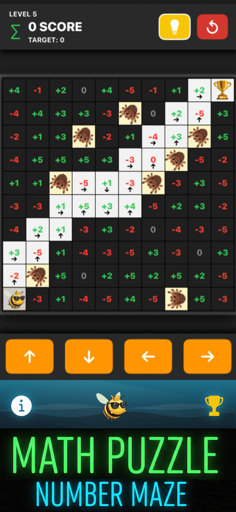
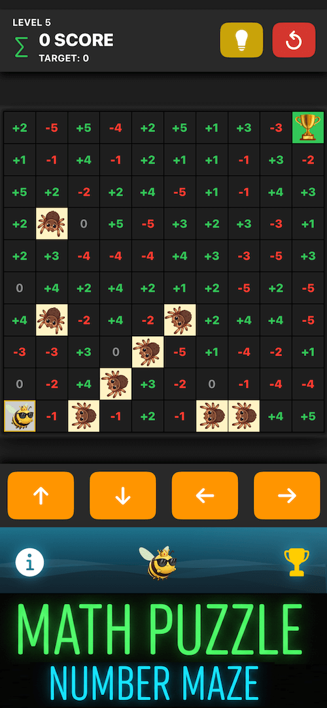

# 🐝 Bee Cross – 67 Number Puzzle
### Sum to Zero – Math Puzzle Game • Clever • Strategic • Fresh Number Maze Logic

## 🏆 Holiday IQ Race is live!
### Only the smartest reach the top 🎄
### Climb the leaderboard before year end.
### 👉 https://apps.apple.com/us/app/id6756260857?eventid=6756467062

## 🎮 About the Game
**Bee Cross – 67 Number Puzzle** is a fresh and clever logic-puzzle game where you guide a little bee across a **10×10 number maze** to reach Home safely.

Each tile contains a **positive or negative number**, and your mission is simple yet challenging:  
**Find a valid path so that the total sum of all numbers you step on equals *zero*** by the time you reach Home.

> Sounds simple… until spider nests appear, numbers grow wilder, and every decision matters.

As levels increase, the number range expands from **–1 → 1** all the way to **–5 → 5**, forcing you to plan, calculate, and pick every step with care.  
And that’s only the beginning—many more surprises await you.

### ✨ Key Features
- 🔢 **Unique zero-sum puzzle gameplay on a 10×10 grid**  
- 🕸️ **Avoid spider nests and find the optimal route**  
- 🌍 **Global leaderboard via Game Center**  
- 📱 **Full support for both iPhone & iPad**  
- 🎵 **Charming visuals & lively sound effects**

---

## 📸 Screenshots

| | | |
|---|---|---|
|  |  |  |

---

## 📲 Download on the App Store  
👉 **https://apps.apple.com/app/bee-cross-67-number-puzzle/id6756260857**

---

## 🛠 Technologies
- Swift / SwiftUI  
- iOS 15+  
- Custom real-time number-maze logic engine  

---

## 🧩 Support
Have a suggestion or found a bug?  
Please open an **Issue** or contact through the App Store.

---
